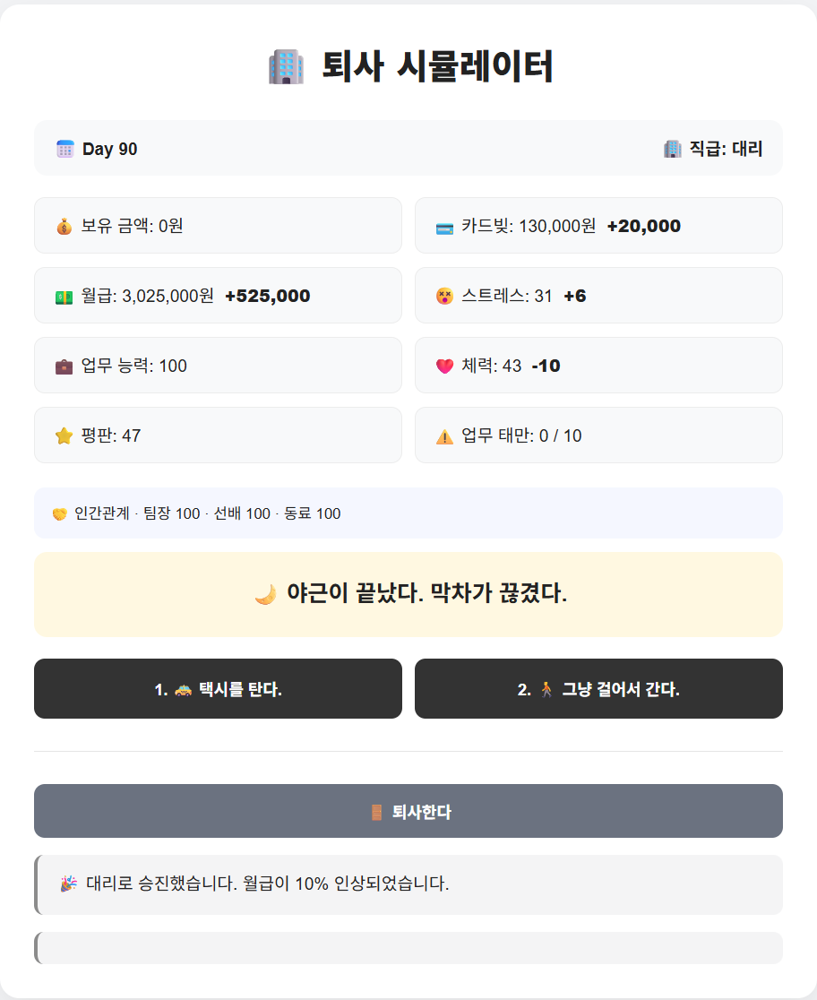
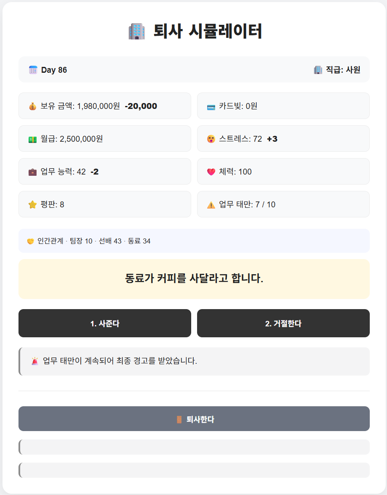
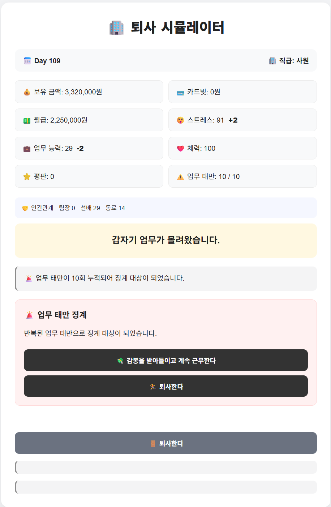
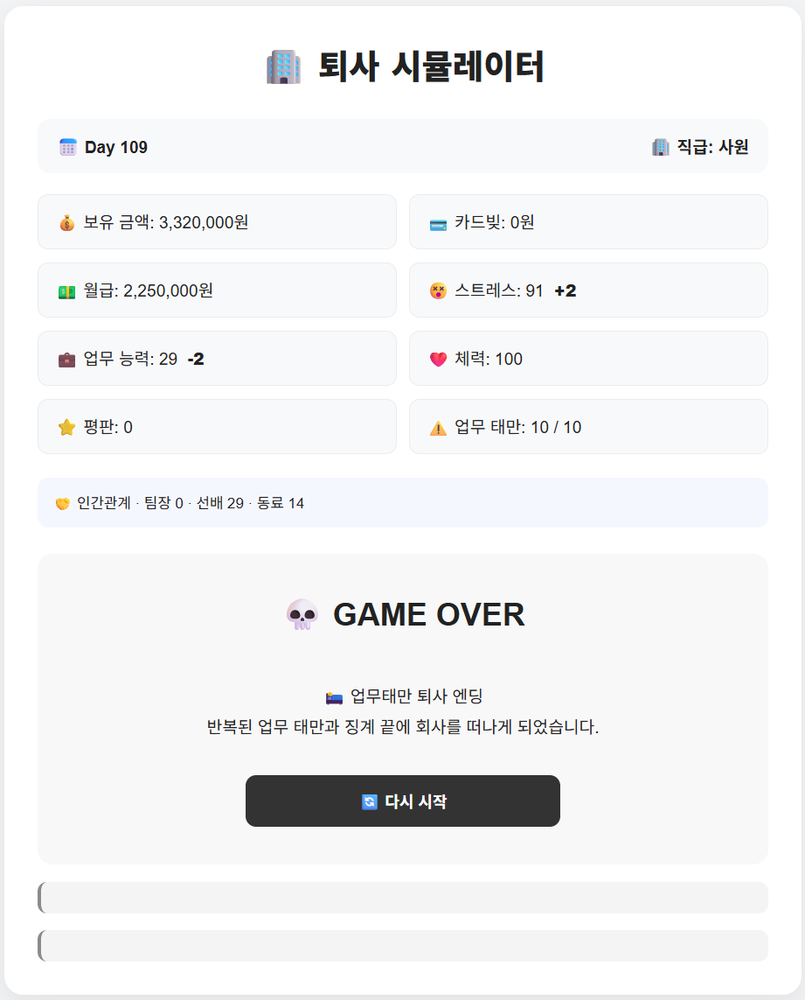
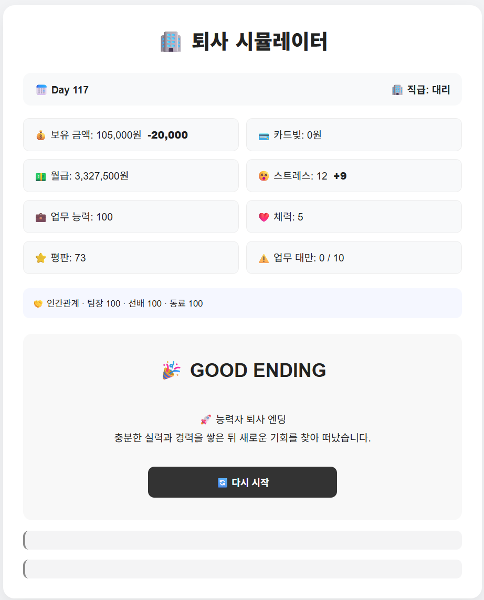

# 🏢 퇴사 시뮬레이터

Spring Boot와 Mustache를 사용해 만든 웹 기반 직장 생활 시뮬레이션 게임입니다.

플레이어는 365일 동안 회사 생활을 하며 다양한 이벤트를 선택하고,
스트레스, 체력, 업무 능력, 평판, 자산, 카드빚 등의 상태를 관리하게 됩니다.

선택과 현재 상태에 따라 승진, 퇴사, 번아웃, 파산, 워라밸 등 다양한 엔딩으로 이어집니다.

---

## 🎮 주요 기능

* 날짜별 랜덤 이벤트
* 선택지에 따른 능력치 변화
* 보유 금액 / 카드빚 / 월급 관리
* 월급 지급 및 월세 처리
* 스트레스 / 체력 / 업무 능력 / 평판 시스템
* NPC 관계도

    * 팀장
    * 선배
    * 동료
* NPC 관계도에 따른 특수 효과
* 업무 태만 및 징계 시스템
* 인사평가 시스템
* 승진 시스템

    * 사원 → 대리
    * 대리 → 과장
    * 과장 → 차장
    * 차장 → 부장
* 과장 승진 포기 시 워라밸 루트
* 자발적 퇴사
* 다양한 퇴사 / 생존 엔딩
* 모바일 화면 대응

---

## 🏆 엔딩

플레이어의 선택과 최종 상태에 따라 다양한 엔딩이 발생합니다.

예시:

* 💀 번아웃 엔딩
* 💳 빚쟁이 엔딩
* 🏃 조기 퇴사 엔딩
* 🚀 능력자 퇴사 엔딩
* 💰 성공적인 퇴사 엔딩
* 🌿 워라밸 퇴사 엔딩
* 🏆 엘리트 직장인 엔딩
* 💰 자산가 직장인 엔딩
* 🏢 1년 생존 엔딩
* 👑 복합 조건 엔딩

---

## 📸 실행 화면











---

## 🛠 기술 스택

### Backend

* Java 17
* Spring Boot
* Gradle

### Frontend

* Mustache
* HTML
* CSS

---

## 📁 프로젝트 구조

```text
src
└─ main
   ├─ java
   │  └─ com.example.resignationweb
   │     ├─ GameService.java
   │     ├─ Player.java
   │     ├─ Event.java
   │     ├─ EventManager.java
   │     ├─ MoneyManager.java
   │     ├─ PromotionManager.java
   │     ├─ PerformanceManager.java
   │     ├─ EndingManager.java
   │     ├─ NpcManager.java
   │     └─ controller
   │        └─ GameController.java
   │
   └─ resources
      ├─ static
      │  └─ css
      │     └─ game.css
      │
      └─ templates
         └─ game.mustache
```

---

## ▶ 실행 방법

프로젝트를 실행한 뒤 브라우저에서 아래 주소로 접속합니다.

```text
http://localhost:8080/game
```

IntelliJ에서 `ResignationWebApplication`을 실행하면 됩니다.

---

## 📱 같은 Wi-Fi에서 모바일 테스트

PC와 스마트폰이 같은 Wi-Fi에 연결되어 있다면
PC의 IPv4 주소를 사용해 스마트폰에서도 접속할 수 있습니다.

예:

```text
http://192.168.0.10:8080/game
```

---

## 💡 프로젝트 목적

Java와 Spring Boot를 공부하면서 단순 문법 학습이 아닌
실제로 동작하는 하나의 서비스를 직접 만들어보기 위해 시작한 프로젝트입니다.

게임 로직을 여러 Manager 클래스로 분리하고,
Controller와 Service를 통해 웹 화면과 연결하는 방식으로 구현했습니다.

콘솔 프로그램으로 시작했던 아이디어를 Spring Boot 웹 프로젝트로 확장하면서
객체지향 구조, HTTP 요청 처리, MVC 구조, 서버 사이드 렌더링을 직접 경험하는 것을 목표로 했습니다.

---

## 📌 개발 상태

현재 기본 게임 플레이 및 엔딩 시스템 구현을 완료했습니다.

추가 기능 개발보다는 현재 버전을 완성본으로 유지하고,
필요한 경우 UI 개선 및 배포를 진행할 예정입니다.
