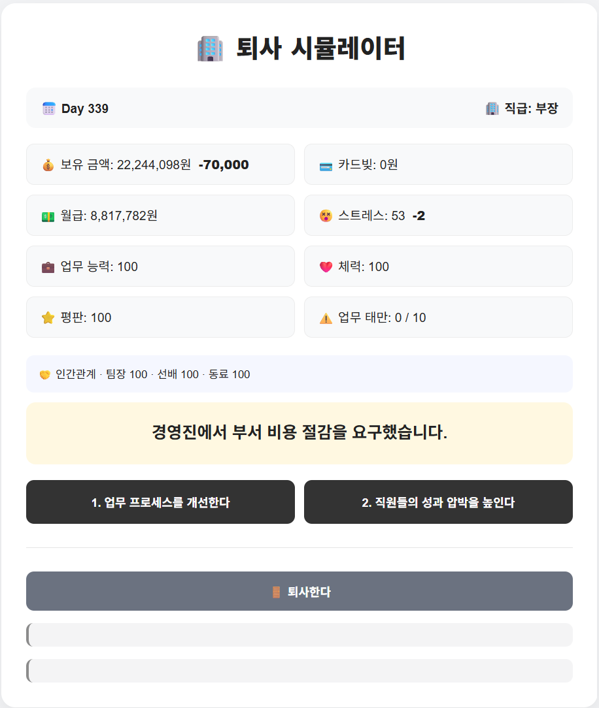
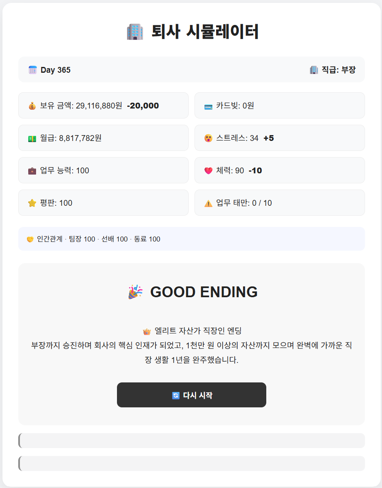

# 🏢 퇴사 시뮬레이터

직장 생활 365일을 버티며 다양한 선택을 하고,
스트레스 · 체력 · 업무 능력 · 평판 · 자산 · 카드빚 등을 관리하는
**Spring Boot 기반 웹 시뮬레이션 게임**입니다.

플레이어의 선택과 상태에 따라 승진, 퇴사, 번아웃, 빚쟁이, 워라밸 등
여러 가지 엔딩으로 이어집니다.

---

## 🎮 플레이

👉 [퇴사 시뮬레이터 바로가기](https://resignation-simulator.onrender.com/game)

> Render 무료 서버를 사용하고 있어 오랫동안 접속이 없었던 경우
> 첫 접속 시 서버가 시작되는 데 시간이 조금 걸릴 수 있습니다.

---

## 📸 실행 화면






---

## 🎯 프로젝트 소개

처음에는 Java 콘솔 프로그램으로 시작했으며,
Spring Boot를 학습하면서 웹 기반 게임으로 확장했습니다.

단순히 기능을 구현하는 것뿐 아니라
게임의 각 역할을 여러 클래스로 분리하고
Controller, Service, Manager 구조를 활용해 전체 흐름을 구성하는 데 중점을 두었습니다.

### 주요 학습 목표

* Java 객체지향 구조 연습
* Spring Boot 웹 요청 처리
* Controller와 Service 역할 분리
* Mustache를 이용한 서버 사이드 렌더링
* 사용자 선택에 따른 상태 관리
* 복합 조건 기반 게임 로직 구현
* Git / GitHub를 이용한 버전 관리
* Docker를 이용한 실행 환경 구성
* Render를 이용한 실제 웹 서비스 배포

---

## 🎮 주요 기능

### 📅 365일 직장 생활

플레이어는 하루씩 진행되는 회사 생활에서
매일 발생하는 이벤트에 따라 선택을 하게 됩니다.

선택 결과에 따라 다음 상태가 변화합니다.

* 💰 보유 금액
* 💳 카드빚
* 💵 월급
* 😵 스트레스
* 💼 업무 능력
* ❤️ 체력
* ⭐ 평판
* ⚠️ 업무 태만

---

### 🎲 이벤트 시스템

날짜와 현재 직급에 따라 다양한 이벤트가 발생합니다.

각 선택에 따라 다음과 같은 결과가 적용됩니다.

* 능력치 변화
* 돈 획득 / 지출
* NPC 관계도 변화
* 업무 태만 누적
* 후속 이벤트 발생

---

### 🤝 NPC 관계도

회사 내 주요 NPC와 관계도가 존재합니다.

* 팀장
* 선배
* 동료

플레이어의 선택에 따라 관계도가 변화하며
특정 조건을 충족하면 게임 플레이에 영향을 주는 효과가 발생합니다.

---

### 📈 승진 시스템

일정 조건을 충족하면 직급이 상승합니다.

```text
사원
 ↓
대리
 ↓
과장
 ↓
차장
 ↓
부장
```

승진에는 업무 능력, 평판, 인사평가 등이 영향을 줍니다.

일부 승진에서는 플레이어가 직접 승진 여부를 선택할 수 있으며,
승진을 포기하면 워라밸 중심의 다른 플레이 방향으로 이어질 수 있습니다.

---

### 📋 인사평가

특정 날짜마다 인사평가가 진행됩니다.

플레이어의 상태에 따라 평가 결과가 달라지고,
평가 결과가 지나치게 낮은 경우 권고사직으로 게임이 종료될 수 있습니다.

---

### ⚠️ 업무 태만

일부 이벤트에서 업무를 대충 처리하면
업무 태만 수치가 누적됩니다.

누적 정도에 따라 다음 상황이 발생할 수 있습니다.

* 경고
* 최종 경고
* 징계
* 감봉
* 퇴사

---

### 💰 자산 관리

직장 생활 중 수입과 지출을 관리합니다.

* 월급
* 생활비
* 월세
* 이벤트 수입
* 이벤트 지출
* 카드빚

보유 금액이 부족하면 카드빚으로 전환되며,
카드빚이 일정 수준 이상 누적되면 빚쟁이 엔딩이 발생합니다.

---

## 🏁 엔딩 시스템

플레이어의 선택과 최종 상태에 따라 다양한 엔딩이 발생합니다.

### 자발적 퇴사 엔딩

* 🏃 조기 퇴사
* 🚀 능력자 퇴사
* 💰 성공적인 퇴사
* 🌿 워라밸 퇴사
* 👑 복합 조건 엔딩
* 🚪 평범한 퇴사

### 강제 엔딩

* 💀 번아웃
* 💳 빚쟁이
* 📉 권고사직

### 365일 완주 엔딩

* 🌿 워라밸 직장인
* 🏆 엘리트 직장인
* 💰 자산가 직장인
* 👑 복합 완주 엔딩
* 🏢 1년 생존

---

## 🛠 기술 스택

### Backend

* Java 17
* Spring Boot
* Gradle

### Frontend

* Mustache
* HTML
* CSS

### Deployment

* Docker
* Render

### Version Control

* Git
* GitHub

---

## 🏗 프로젝트 구조

```text
resignation-simulator
├─ Dockerfile
├─ README.md
├─ build.gradle
├─ settings.gradle
├─ images
│  ├─ 1.png
│  ├─ 2.png
│  ├─ 3.png
│  ├─ 4.png
│  ├─ 5.png
│  ├─ 6.png
│  └─ 7.png
│
└─ src
   └─ main
      ├─ java
      │  └─ com.example.resignationweb
      │     ├─ GameService.java
      │     ├─ Player.java
      │     ├─ Event.java
      │     ├─ EventManager.java
      │     ├─ MoneyManager.java
      │     ├─ PromotionManager.java
      │     ├─ PerformanceManager.java
      │     ├─ EndingManager.java
      │     ├─ NpcManager.java
      │     ├─ NeglectManager.java
      │     └─ controller
      │        └─ GameController.java
      │
      └─ resources
         ├─ static
         │  └─ css
         │     └─ game.css
         │
         └─ templates
            └─ game.mustache
```

---

## 🧩 구조

게임의 주요 기능은 역할에 따라 클래스를 분리했습니다.

```text
GameController
      ↓
GameService
      ↓
Player / Event
      ↓
각 Manager 클래스
```

### GameController

HTTP 요청을 받아 `GameService`에 전달합니다.

예:

```text
/game
/game/choice
/game/salary
/game/restart
/game/promotion/accept
/game/promotion/decline
```

### GameService

게임의 현재 상태와 하루 진행 흐름을 관리하며
각 Manager 클래스를 연결하는 중심 역할을 담당합니다.

### Manager

기능별로 역할을 분리했습니다.

* `EventManager` : 이벤트 관리
* `MoneyManager` : 돈 / 월급 / 카드빚 관리
* `PromotionManager` : 승진 관리
* `PerformanceManager` : 인사평가 관리
* `EndingManager` : 엔딩 판정
* `NpcManager` : NPC 및 관계도 관리
* `NeglectManager` : 업무 태만 관리

---

## ▶ 로컬 실행

IntelliJ에서 `ResignationWebApplication`을 실행한 뒤
브라우저에서 아래 주소로 접속합니다.

```text
http://localhost:10000/game
```

---

## 📱 모바일 대응

CSS Media Query를 적용해
PC뿐 아니라 스마트폰에서도 플레이할 수 있도록 구성했습니다.

---

## 🐳 Docker

Render 배포를 위해 프로젝트 루트에 `Dockerfile`을 구성했습니다.

Docker 환경에서 Gradle을 이용해 Spring Boot 프로젝트를 빌드한 뒤
Java 17 Runtime에서 생성된 JAR 파일을 실행합니다.

```text
Dockerfile
↓
Gradle Build
↓
Spring Boot JAR 생성
↓
Java 17 Runtime 실행
```

---

## 🚀 배포

GitHub Repository와 Render를 연결해 배포했습니다.

배포 환경에서는 Render가 전달하는 `PORT` 값을 사용하도록 설정했습니다.

```properties
spring.application.name=resignation-web
server.port=${PORT:10000}
server.address=0.0.0.0
```

### 배포 주소

👉 https://resignation-simulator.onrender.com/game

---

## 💡 개발하면서 배운 점

콘솔 프로그램을 웹 애플리케이션으로 변경하면서
단순히 Java 문법을 작성하는 것과 실제 웹 서비스를 만드는 것의 차이를 경험했습니다.

기능이 늘어날수록 하나의 클래스에 모든 코드를 작성하기보다
역할별로 책임을 나누는 구조가 중요하다는 점을 배웠습니다.

또한 사용자 선택 이후의 상태 변화, 승진 조건, 엔딩 조건처럼
여러 상태가 동시에 영향을 주는 로직을 구현하면서
조건을 단순한 순서가 아니라 독립적인 상태로 관리하는 방법을 고민했습니다.

마지막으로 Git과 GitHub를 이용한 버전 관리부터
Docker와 Render를 이용한 배포까지 진행하면서
로컬에서만 실행되던 프로그램을 외부 사용자가 직접 접속할 수 있는 웹 서비스로 완성했습니다.

---

## 📌 현재 상태

* ✅ 기본 게임 플레이 구현
* ✅ 이벤트 시스템
* ✅ 자산 / 카드빚 시스템
* ✅ NPC 관계도
* ✅ 업무 태만 및 징계
* ✅ 승진 시스템
* ✅ 인사평가
* ✅ 다양한 엔딩
* ✅ 모바일 화면 대응
* ✅ GitHub 버전 관리
* ✅ Docker 환경 구성
* ✅ Render 배포

현재 기본 기능 구현 및 배포를 완료했습니다.
